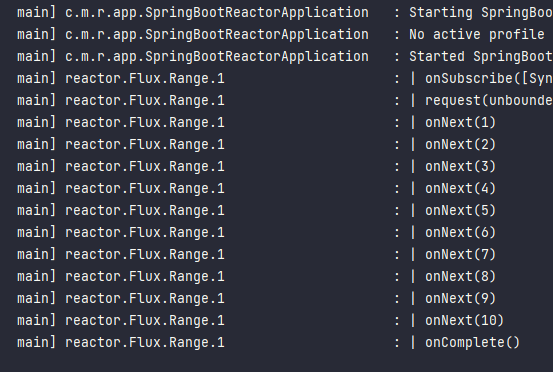
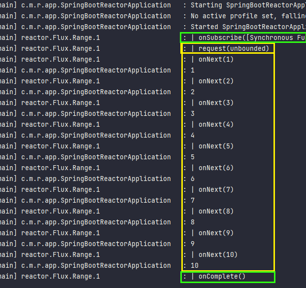
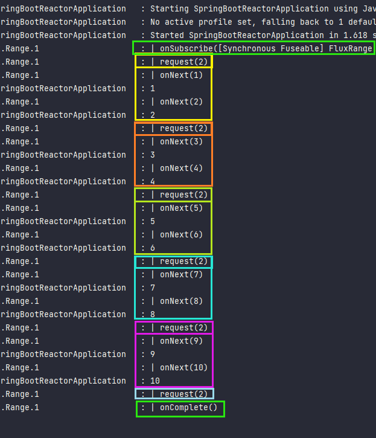
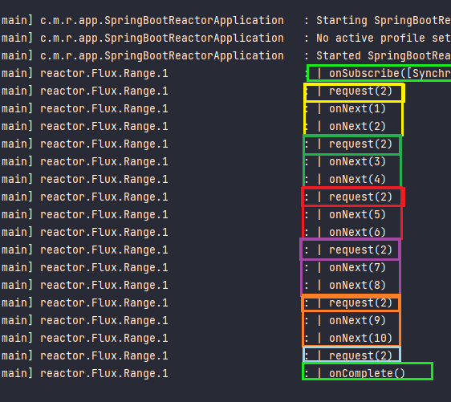

# Sección 02: Reactor API: Programación reactiva desde la base

Proyecto realizado en el curso de **Programación Reactiva con Spring Boot y Spring WebFlux** de Andrés Guzmán (Udemy)

### Reactive Streams

Reactive Streams es una iniciativa para proporcionar un estándar para el procesamiento asíncrono de flujos con
contrapresión sin bloqueo. ``Es la especificación para la programación reactiva``.

### Project Reactor

Reactor es una biblioteca reactiva de cuarta generación, **basada en la especificación Reactive Streams**, para crear
aplicaciones sin bloqueo en la JVM.``Es la implementación.``

Si hacemos una analogía, Reactive Streams es a JPA como Project Reactor es a Hibernate, en pocas palabras, son la
**especificación** e **implementación** respectivamente.

## Creando Proyecto con Reactor API

Para usar el Proyecto Reactor en Spring Boot solo necesitamos agregar la siguiente dependencia que fue obtenida de la
página de [Projectreactor.io](https://projectreactor.io/docs/core/release/reference/#getting):

````xml

<dependency>
    <groupId>io.projectreactor</groupId>
    <artifactId>reactor-core</artifactId>
</dependency>
````

## Creando un Stream Flux Observable

En este proyecto de Spring Boot trabajaremos netamente en consola, para eso podemos implementar la interfaz funcional
**CommandLineRunner** o en su defecto podemos crear un @Bean donde implementemos dicha interfaz:

````java

@SpringBootApplication
public class SpringBootReactorApplication {

    public static void main(String[] args) {
        SpringApplication.run(SpringBootReactorApplication.class, args);
    }

    @Bean
    public CommandLineRunner run() {
        return args -> {
            Flux<String> nombres = Flux.just("Martín", "Livved", "Candi", "Iselita")
                    .doOnNext(System.out::println);

            nombres.subscribe();
        };
    }
}
````

**DONDE**

- `Flux`, es un publisher, por lo tanto, un observable. Emite una secuencia asíncrona de 0 a N elementos **(onNext)**
  y termina con una señal **(onComplete)**. También puede terminar con una seña **(onError)**.
- En el código anterior estamos creando un `Flux de Strings`.
- No sucederá nada hasta que nos subscribamos `.subscribe()`.
- `.doOnNext()`, es una especie de callback que se ejecuta cuando un Publisher emite un elemento, pero no afecta el
  flujo, es decir, devuelve el publicador original inmediatamente.

**NOTA**

- `Mono` y `Flux` son implementaciones de la interfaz `Publisher`.
- `Mono` es un tipo especial de `Publisher`. Un objeto Mono representa un valor único o vacío. Esto significa que sólo
  puede emitir un valor como máximo para la petición onNext() y luego termina con la señal onComplete(). En caso de
  fallo, sólo emite una única señal onError().
- `Flux` es un `Publisher` estándar que representa de 0 a N valores de secuencia asíncrona. Esto significa que puede
  emitir de 0 a muchos valores, posiblemente valores infinitos para peticiones onNext(), y luego termina con una señal
  de finalización o de error.

**IMPORTANTE**
> Como estamos iniciando en el aprendizaje de programación reactiva, estamos usando el método ``.subscribe()``, pero
> según tengo entendido, en un proyecto ya real, nosotros nunca haremos eso, ya que quien se subscribirá serán quienes
> llamen a las API Rest por ejemplo, o como más adelante usaremos el mismo Thymeleaf, será quien haga el
> subscribe() para desencadenar la ejecución.
>
> Métodos que devuelven un tipo `Publisher (Mono, Flux)` no deberían subscribirse(subscribe o block) porque ello
> podría romper la cadena del publicador.

## El método subscribe()

Cuando hacemos el **subscribe()** empezamos a observar, por lo tanto, se trata de un consumidor, un **Observer** que
consume cada elemento que emite el **Observable**. No solo puede consumir, sino también puede manejar cualquier tipo
de error que pueda ocurrir.

````java

@SpringBootApplication
public class SpringBootReactorApplication {

    private static final Logger LOG = LoggerFactory.getLogger(SpringBootReactorApplication.class);

    /* other code */

    @Bean
    public CommandLineRunner run() {
        return args -> {
            Flux<String> nombres = Flux.just("Martín", "", "Candi", "Iselita")
                    .doOnNext(name -> {
                        if (name.isEmpty()) {
                            throw new RuntimeException("Nombre no pueden ser vacíos");
                        }
                        System.out.println(name);
                    });

            nombres.subscribe(LOG::info, error -> LOG.error(error.getMessage()));
        };
    }

}
````

## El evento onComplete

El evento onComplete se ejecuta solo si finaliza la emisión de todos los elementos del flujo. Si ocurre un error en el
proceso, el evento onComplete no se ejecuta, sino el evento onError.

````java

@SpringBootApplication
public class SpringBootReactorApplication {

    /* other code */

    @Bean
    public CommandLineRunner run() {
        return args -> {
            Flux<String> nombres = Flux.just("Martín", "Lidia", "Candi", "Iselita")
                    .doOnNext(name -> {
                        if (name.isEmpty()) {
                            throw new RuntimeException("Nombre no pueden ser vacíos");
                        }
                        System.out.println(name);
                    });

            nombres.subscribe(
                    LOG::info,
                    error -> LOG.error(error.getMessage()),
                    new Runnable() {
                        @Override
                        public void run() {
                            LOG.info("Ha finalizado la ejecución del observable con éxito!");
                        }
                    });
        };
    }
}
````

## El operador map

Recibe cada elemento y lo transforma a otro tipo de elemento. **Las modificaciones que hacemos con los operadores
no modifica el flujo original,** más bien lo que hace es **retornar una nueva instancia** de otro flux a partir
del original, pero con los datos modificados.

Para este ejemplo, transformaremos un flujo de Strings a un objeto del tipo User

````java
public class User {
    private String name;
    private String lastName;

    public User(String name, String lastName) {
        this.name = name;
        this.lastName = lastName;
    }

    /* setters and getters methods */
    /* toString() method */
}
````

````java

@SpringBootApplication
public class SpringBootReactorApplication {

    /* other code */

    @Bean
    public CommandLineRunner run() {
        return args -> {
            Flux<User> users = Flux.just("Martín", "Lidia", "Candi", "Iselita")
                    .map(name -> new User(name.toUpperCase(), null))
                    .doOnNext(user -> {
                        if (user == null) {
                            throw new RuntimeException("Usuario no pueden ser null");
                        }
                        System.out.println(user);
                    });

            users.subscribe(
                    user -> LOG.info(user.toString()),
                    error -> LOG.error(error.getMessage()),
                    new Runnable() {
                        @Override
                        public void run() {
                            LOG.info("Ha finalizado la ejecución del observable con éxito!");
                        }
                    });
        };
    }

}
````

## El operador filter

No permite filtrar valores, como parámetro recibe un predicate (función de valor booleano) de un argumento.

````java

@SpringBootApplication
public class SpringBootReactorApplication {
    /* omitted code */

    @Bean
    public CommandLineRunner run() {
        return args -> {
            Flux<User> users = Flux.just("Martín Flores", "Liz Gonzales", "Candi Abanto", "Isela Pimentel", "Bruce Lee", "Bruce Willis")
                    .map(name -> new User(name.split(" ")[0], name.split(" ")[1]))
                    .filter(user -> user.getName().equalsIgnoreCase("Bruce")) //<-- filtramos por el nombre "Bruce"
                    .doOnNext(user -> {
                        if (user == null) {
                            throw new RuntimeException("Usuario no pueden ser null");
                        }
                        System.out.println(user);
                    });

            /* omitted code */
        };
    }
}
````

## Los observables son inmutables

Una de las características que tienen los streams reactive es la inmutabilidad. Cuando tenemos un flujo de datos, y
empezamos a usar operadores para transformar el flujo, no es que se vaya a cambiar el flujo original, sino que,
se van creando nuevas instancias de flujos por cada nuevo operador que usemos.

En el siguiente ejemplo obervamos un flujo original de Strings, al que le aplicamos posteriormente un map y un filter,
ahora, nos subscribimos al flujo de Strings y vemos que los valores se mantienen tal cual.

````java

@SpringBootApplication
public class SpringBootReactorApplication {

    /* omitted code */

    @Bean
    public CommandLineRunner run() {
        return args -> {
            Flux<String> names = Flux.just("Martín Flores", "Liz Gonzales", "Candi Abanto", "Isela Pimentel", "Bruce Lee", "Bruce Willis");

            Flux<User> users = names.map(name -> new User(name.split(" ")[0], name.split(" ")[1]))
                    .filter(user -> user.getName().equalsIgnoreCase("Bruce"));

            names.subscribe(LOG::info);
        };
    }
}
````

## Creando un Flux (Observable) a partir de un List o Iterable

Podemos usar la función **.fromIterable(...)** para convertir una lista en un **Flux**.

````java

@SpringBootApplication
public class SpringBootReactorApplication {

    /* omitted code */

    @Bean
    public CommandLineRunner run() {
        return args -> {
            List<String> namesList = List.of("Martín Flores", "Liz Gonzales", "Candi Abanto", "Isela Pimentel", "Bruce Lee", "Bruce Willis");
            Flux<String> names = Flux.fromIterable(namesList);

            Flux<User> users = names.map(name -> new User(name.split(" ")[0], name.split(" ")[1]))
                    .filter(user -> user.getName().equalsIgnoreCase("Bruce"));

            users.subscribe(user -> LOG.info(user.toString()));
        };
    }
}
````

## El operador flatMap

Con el flatMap, convertimos un dato a otro flujo (Mono o Flux) y por debajo, el **flatMap aplanará el flujo para
convertir todos los flujos en uno solo.** La diferencia con el map es que con map trabajamos con datos como
normalmente hemos venido trabajando, mientras que con flatMap, trabajamos con flujos.

````java

@SpringBootApplication
public class SpringBootReactorApplication {

    /* omitted code */

    private void flatMapExample() {
        List<String> namesList = List.of("Martín Flores", "Liz Gonzales", "Candi Abanto", "Isela Pimentel", "Bruce Lee", "Bruce Willis");
        Flux<String> names = Flux.fromIterable(namesList);

        Flux<User> users = names.map(name -> new User(name.split(" ")[0], name.split(" ")[1]))
                .flatMap(user -> {
                    if (user.getName().equalsIgnoreCase("bruce")) {
                        return Mono.just(user);
                    }
                    return Mono.empty();
                });

        users.subscribe(user -> LOG.info(user.toString()));
    }

    /* omitted code */

}
````

## Convirtiendo un Flux List a un Flux String con operador map

````java

/* omitted code */

@SpringBootApplication
public class SpringBootReactorApplication {

    private void fromUserToString() {
        List<User> userList = List.of(
                new User("Martín", "Flores"),
                new User("Liz", "Gonzales"),
                new User("Candi", "Abanto"),
                new User("Isela", "Pimentel"),
                new User("Bruce", "Lee"),
                new User("Bruce", "Willis"));
        Flux<User> users = Flux.fromIterable(userList);

        Flux<String> names = users.map(user -> String.format("%s %s", user.getName(), user.getLastName()));

        names.subscribe(LOG::info);
    }
}
````

## Convirtiendo un Observable Flux a Mono

En el ejemplo convertiremos un Flux de usuarios, a un mono de tipo List de usuario, es decir, en vez de que se emita
cada elemento de la lista, vamos a emitir de una vez la lista completa.
****

````java

@SpringBootApplication
public class SpringBootReactorApplication {
    private void convertFluxToMonoList() {
        List<User> userList = List.of(
                new User("Martín", "Flores"),
                new User("Liz", "Gonzales"),
                new User("Candi", "Abanto"),
                new User("Isela", "Pimentel"),
                new User("Bruce", "Lee"),
                new User("Bruce", "Willis"));
        Flux.fromIterable(userList)
                .collectList()
                .subscribe(users -> LOG.info(users.toString()));
    }
}
````

## Combinando dos flujos con el operador flatMap

La idea es tener dos streams (flujos) distintos, uno de usuarios y otro con sus comentarios, luego poder combinar estos
dos flujos en uno solo utilizando **flatMap** y que el tipo del **flujo resultante sea usuarioConComentarios** de un
tipo intermedio que combine ambos streams.

````java

@SpringBootApplication
public class SpringBootReactorApplication {
    private void combinedUserAndCommentWithFlatMap() {
        Mono<User> userMono = Mono.fromCallable(() -> new User("Rocky", "Balboa")); // Otra forma de crear un mono
        Mono<Comment> commentMono = Mono.fromCallable(() -> {
            Comment comment = new Comment();
            comment.addComment("Hola Ivan, qué tal!");
            comment.addComment("Cuando pactamos otra pelea?");
            comment.addComment("me avisas, estaré pendiente, saludos.");
            return comment;
        });

        // 1° forma: Usando flatMap - flatMap
        Mono<UserComment> userCommentMonoFlatMapFlatMap = userMono.flatMap(user -> commentMono.flatMap(comment -> Mono.just(new UserComment(user, comment))));
        userCommentMonoFlatMapFlatMap.subscribe(userComment -> LOG.info(userComment.toString()));

        // 2° forma: Usando flatMap - Map
        Mono<UserComment> userCommentMonoFlatMapMap = userMono.flatMap(user -> commentMono.map(comment -> new UserComment(user, comment)));
        userCommentMonoFlatMapMap.subscribe(userComment -> LOG.info(userComment.toString()));
    }
}
````

**En la primera forma** usamos el método estático **Mono.just(...)** para envolver el objeto **UserComment** en un mono,
a diferencia de **map** que te **devuelve el objeto** directamente **sin envolver nada.** Podríamos ahorrarnos invocar
el método just de Mono para envolver la clase, tan solo **usando un flatMap** descartando
el segundo, **ya que la interfaz function** que recibe cómo parámetro el primer flatMap **ya nos dice que devolverá un
mono**, **envolviendo "automáticamente"** nuestra clase UserComment.

## Combinando dos flujos con el operador zipWith

Con el operador zipWith combinamos dos streams como lo hicimos con el flatMap del ejemplo anterior:

- Forma 1

````java

@SpringBootApplication
public class SpringBootReactorApplication {
    /* omitted code */
    private void combinedZipWithForm1() {
        Mono<User> userMono = Mono.fromCallable(() -> new User("Rocky", "Balboa"));
        Mono<Comment> commentMono = Mono.fromCallable(() -> {
            Comment comment = new Comment();
            comment.addComment("Hola Ivan, qué tal!");
            comment.addComment("Cuando pactamos otra pelea?");
            comment.addComment("me avisas, estaré pendiente, saludos.");
            return comment;
        });

        Mono<UserComment> userCommentMono = userMono.zipWith(commentMono, UserComment::new);
        userCommentMono.subscribe(userComment -> LOG.info(userComment.toString()));
    }
}
````

- Forma 2

````java

@SpringBootApplication
public class SpringBootReactorApplication {
    /* omitted code */
    private void combinedZipWithForm2() {
        Mono<User> userMono = Mono.fromCallable(() -> new User("Rocky", "Balboa")); // Otra forma de crear un mono
        Mono<Comment> commentMono = Mono.fromCallable(() -> {
            Comment comment = new Comment();
            comment.addComment("Hola Ivan, qué tal!");
            comment.addComment("Cuando pactamos otra pelea?");
            comment.addComment("me avisas, estaré pendiente, saludos.");
            return comment;
        });

        Mono<UserComment> userCommentMono = userMono.zipWith(commentMono)
                .map(tuple -> {
                    User u = tuple.getT1();
                    Comment c = tuple.getT2();
                    return new UserComment(u, c);
                });
        userCommentMono.subscribe(userComment -> LOG.info(userComment.toString()));
    }
}
````

## El operador range

Nos permite crear un flux de un rango, ejemplo: ``Flux.range(0, 4)``. Los valores serían: ``0,1,2,3``.

````java

@SpringBootApplication
public class SpringBootReactorApplication {
    /* omitted code */
    private void zipWithAndRanges() {
        Flux.just(1, 2, 3, 4) // numSequence
                .map(number -> number * 2)
                .zipWith(Flux.range(0, 4)/*numRange*/, (numSequence, numRange) -> String.format("[1] flux: %d, [2] flux: %d", numSequence, numRange))
                .subscribe(LOG::info);
    }
}
````

## Intervalos de tiempo con operador interval y zipWith

**Interval:** Crea un flujo que emite valores largos que comiencen con 0 y se incrementen en intervalos de tiempo
específicos en el temporizador global. El primer elemento se emite después de un retraso inicial igual al período.

Si ejecutamos el código de abajo, al finalizar la ejecución **no veremos algún resultado en consola, ¿por qué?**,
en realidad nuestro observable **se sigue ejecutando en segundo plano**, no se sale como lo hace nuestro **main()**,
por eso es que no vemos resultados en consola, porque en realidad está ejecutándose de manera asíncrona en segundo
plano, eso se debe precisamente al **interval**, al que aplicamos un retraso de prácticamente 12 segundos, mientras que
en paralelo, el método **main()** se ejecutó y finalizó de inmediato.

Recordar que una de las características de la programación reactiva es el de **ser sin bloqueo**, no bloquea los
procesos y los flujos en la máquina virtual, se siguen ejecutando en distintos hilos, se ejecutan en paralelo.

````java

@SpringBootApplication
public class SpringBootReactorApplication {
    /* omitted code */
    private void intervalExample() {
        Flux<Integer> range = Flux.range(1, 12);
        Flux<Long> delay = Flux.interval(Duration.ofSeconds(1));

        range.zipWith(delay, (numRange, valDelay) -> numRange)
                .doOnNext(integer -> LOG.info(integer.toString()))
                .subscribe();
    }

}
````

Entonces, **¿cómo podríamos visualizar el delay?**. Bueno, tendríamos que forzar el flujo range para que sea con
bloqueo (``no es recomendable bloquear, solo lo haremos para el ejemplo``). Usaremos el **blockLast()**, el cual
se subscribe al flujo, pero lo bloquea hasta que se haya emitido el último elemento.

````java

@SpringBootApplication
public class SpringBootReactorApplication {
    private void intervalExample() {
        Flux<Integer> range = Flux.range(1, 12);
        Flux<Long> delay = Flux.interval(Duration.ofSeconds(1));

        range.zipWith(delay, (numRange, valDelay) -> numRange)
                .doOnNext(integer -> LOG.info(integer.toString()))
                .blockLast(); // se subscribe al flujo, pero bloquea hasta que se haya emitido el último elemento
    }
}
````

Otra forma de aplicar intervalos de tiempo, usando **delayElements(...)**:

````java

@SpringBootApplication
public class SpringBootReactorApplication {
    private void delayElementsExample() {
        Flux<Integer> range = Flux.range(1, 12)
                .delayElements(Duration.ofSeconds(1))
                .doOnNext(integer -> LOG.info(integer.toString()));

        range.blockLast(); // se subscribe al flujo, pero bloquea hasta que se haya emitido el último elemento
    }
}
````

## Intervalos infinitos con interval y operador retry

````java

@SpringBootApplication
public class SpringBootReactorApplication {
    /* omitted code */
    private void infiniteIntervalExample() throws InterruptedException {
        CountDownLatch latch = new CountDownLatch(1);

        Flux.interval(Duration.ofSeconds(1))
                .flatMap(i -> {
                    if (i == 5) {
                        return Flux.error(new InterruptedException("Solo hasta 5"));
                    }
                    return Flux.just(i);
                })
                .map(i -> "Hola " + i)
                .retry(2)
                .doOnTerminate(latch::countDown)
                .subscribe(
                        LOG::info,
                        e -> LOG.error(e.getMessage())
                );

        latch.await();
    }
}
````

**Explicación del código anterior**

> Usamos el doOnTerminate en conjunto con el CountDownLatch para mantener el hilo corriendo hasta que termine, para que
> se muestre en el terminal los datos del intervalo hasta 5, cuando llega a 5 interrumpimos el flujo con un exception y
> un Flux.error para finalizar el flujo y asi se ejecute el doOnTerminate estableciendo el countDown a cero para que
> libere el hilo. En resumen, el doOnTerminate permite liberar y soltar el proceso hasta que llega a 5, se lanza el
> error y termina el bloqueo del CountDownLatch llegando a 0.

**DONDE**

- **CountDownLatch**, un CountDownLatch inicializado con una cuenta de uno sirve como un pestillo de encendido/apagado
  simple, o puerta: todos los subprocesos que invocan await esperan en la puerta hasta que la abre un subproceso que
  invoca a countDown. Un CountDownLatch se inicializa con un conteo dado. Los métodos await se bloquean hasta que el
  recuento actual llega a cero debido a las invocaciones del método countDown, después de lo cual se liberan todos los
  subprocesos en espera y cualquier invocación posterior de await regresa inmediatamente.
- **countDown**, disminuye el conteo del latch, liberando todos los subprocesos en espera si el conteo llega a cero.
- **await()**, hace que el subproceso actual espere hasta que el latch haya llegado a cero, a menos que se interrumpa el
  subproceso.
- **doOnTerminate()**, agrega el comportamiento (efecto secundario) que se activa cuando Flux finaliza, ya sea al
  completarse correctamente o al fallar con un error.
- **retry()**, se vuelve a suscribir a esta secuencia Flux si señala algún error, por un número fijo de veces. Tenga en
  cuenta que pasar Long.MAX_VALUE se trata como un reintento infinito.

## El operador create para crear desde cero un Observable Flux

Crearemos desde cero un Flux (Observable), emitiendo las tres opciones: **next, error, complete**. Para el ejemplo
usaremos un generador de números aleatorios entre [1 - 10] incluyendo los extremos (en el tutorial usa un contador, pero
yo quise variar el ejemplo). Cada 1 segundo se generará un número aleatorio y dependiendo del valor generado emitimos la
tarea (next), lanzamos un error (error) o completamos la tarea (complete). En pocas palabras, **crearemos nuestro propio
Observable usando el método create() del Flux:**

````java

@SpringBootApplication
public class SpringBootReactorApplication {
    /* omitted code */
    private void infiniteIntervalExampleFromCreate() {
        Flux.create(emitter -> { //emitter, objeto que nos permite crear nuestro observable
                    Timer timer = new Timer();
                    timer.schedule(new TimerTask() {
                        @Override
                        public void run() {
                            Integer randomNumber = (int) (Math.random() * 10 + 1);
                            emitter.next(randomNumber);     // <-- (1) Emite los valores
                            if (randomNumber.equals(5)) {
                                timer.cancel();
                                emitter.error(new InterruptedException("¡Error, se detuvo el flux por el 5!")); //<-- (2) Emite un error cancelando el Flux
                            }
                            if (randomNumber.equals(10)) {
                                timer.cancel();
                                emitter.complete();            // <-- (3) Finaliza la ejecución del Flux
                            }
                        }
                    }, 1000, 1000);
                })
                .subscribe(
                        next -> LOG.info(next.toString()),           // (1) Recibe los valores emitidos
                        error -> LOG.error(error.getMessage()),      // (2) Recibe el error generado
                        () -> LOG.info("¡Fín, se obtuvo 10!"));      // (3) Se ejecuta luego de que ha finalizado la ejecución del Flux

    }
}
````

**DONDE**

- **Timer**, nos ayudará a ejecutar la tarea cada 1000 milisegundos (1segundo).
- **(1), (2) y (3)**, son las tres opciones que tiene nuestro Flux para poder emitir, lanzar error o completar la tarea.

## Manejando la contrapresión (backpressure)

### Definiciones de contrapresión

- Por defecto, cada vez que nos subscribimos a un observable **solicitamos la cantidad máxima que puede enviar el
  productor,** es decir, le decimos al observable que envíe todos los elementos de una sola vez, pero el problema es que
  si tenemos recursos limitados (hardware, software) podrían ser pesados, abrumador para el subscriptor que se
  subscribe,
  el que pueda procesar toda esa información de una sola vez, aquí es donde entra en juego la **contrapresión**, donde
  **el Subscriptor le pueda indicar al Productor la cantidad de elementos que le tiene que enviar**, por ejemplo, en vez
  de que envíe todos los elementos de una vez, que le envíe solo 5 elementos por lote (cada request que se haga).

- **En la programación reactiva**, la capacidad del cliente para señalizar cuánto trabajo puede manejar **se llama
  contrapresión.**

- Un Observable muy rápido en combinación con un Observer lento puede resultar rápidamente en acumulación de ítems
  sin consumir, que podrían devorar los recursos del sistema y resultar en una **OutOfMemoryException.** **Este problema
  se conoce como backpressure o contrapresión.**

- Es un mecanismo fundamental para manejar la comunicación entre dos componentes de un sistema que operan a diferentes
  velocidades. Se utiliza principalmente en sistemas basados en streams o flujos de datos, como en el contexto de
  programación reactiva o en sistemas de eventos.

  En situaciones normales, cuando un emisor de datos produce información a una tasa más rápida de lo que el receptor
  puede procesar, puede acumularse una gran cantidad de datos sin procesar en el receptor. Esto puede llevar a problemas
  como
  el agotamiento de recursos, retrasos significativos o incluso a la caída del sistema.

  La contrapresión es una solución para evitar esta sobrecarga en el receptor. En lugar de simplemente ignorar o
  descartar los datos adicionales cuando el receptor está sobrecargado, el emisor es notificado para que disminuya
  temporalmente la producción de datos. De esta manera, el receptor puede "presionar hacia atrás" al emisor, indicándole
  que se detenga o reduzca la tasa de emisión hasta que el receptor pueda manejar los datos entrantes.

  Esto crea una especie de equilibrio dinámico entre el emisor y el receptor, **asegurando que ambos componentes
  funcionen en armonía, evitando que el receptor se sobrecargue** y garantizando que los datos no se pierdan.

### Ejemplo: Viendo el comportamiento por defecto

Crearemos un Publisher (Observable) que emitirá un rango de números del 1 al 10. Haremos un subscribe de dicho
observable para observar los elementos emitidos:

````java

@SpringBootApplication
public class SpringBootReactorApplication {
    /* omitted code */
    private void backpressureExampleUsingSubscriber() {
        Flux.range(1, 10)
                .log()
                .subscribe();
    }
}
````

El **log()** nos permite ver la traza completa de nuestro flux. Veremos cómo el subscriptor solicitará la máxima
cantidad de elementos posibles, es decir, cuando hacemos **subscribe(), el observable nos retorna todos los elementos.**
Si ejecutamos la aplicación veremos el resultado mencionado:



Ahora, modificaremos el ejemplo para poder observar el uso de la contrapresión:

````java

@SpringBootApplication
public class SpringBootReactorApplication {
    /* omitted code */
    private void backpressureExampleUsingSubscriber() {
        Flux.range(1, 10)
                .log()
                .subscribe(new Subscriber<Integer>() { // (1)
                    private Subscription subscription;

                    @Override
                    public void onSubscribe(Subscription subscription) { // (2)
                        this.subscription = subscription;
                        this.subscription.request(Long.MAX_VALUE); // (3)
                    }

                    @Override
                    public void onNext(Integer rangeNumber) {
                        LOG.info(rangeNumber.toString()); // (4)
                    }

                    @Override
                    public void onError(Throwable throwable) {

                    }

                    @Override
                    public void onComplete() {

                    }
                });
    }
}
````

**DONDE**

- **(1)** el Subscriber es el Observador que requiere una suscripción.
- **(1)** el ``<Integer>`` lo definimos de ese tipo porque ese es el tipo de dato que el observable emite.
- **(2)** dentro de dicho método programamos la cantidad de datos que podemos pedirle al productor (Observable).
- **(3)** con el ``request(...)`` le decimos que nos envíe la cantidad de elementos que podemos recibir.
- **(3)** definimos dentro del request el ``Long.MAX_VALUE``, con esto le decimos que la cantidad de elementos que
  podemos recibir sea la máxima, es decir todos los elementos. Este es el comportamiento por defecto, el mismo que
  observamos en la superior.

En el ejemplo anterior **estamos implementando al vuelo la interfaz Subscriber** con el que vamos a modificar el
comportamiento por defecto del número de elementos que nos debe retornar el Observable. Sin embargo, aún, en el ejemplo
anterior, estamos mostrando el comportamiento por defecto, es decir, el Observable emitirá todos los elementos de un
solo tiro.

Nuevamente, si volvemos a ejecutar, con esta nueva implementación que aún tiene las características de una
implementación por defecto, obtendremos el siguiente resultado:



A diferencia de la primera imagen, en este segundo ejemplo vemos que se está imprimiendo los valores emitidos, esto es
porque definimos un **LOG()** en el punto **(4)**. Pero lo relevante aquí es que estamos observando nuevamente el
comportamiento por defecto, **se están emitiendo todos los valores de un solo request()**.

### Ejemplo: Usando el Subscriber

Lo que haremos será modificar el número de elementos que vamos a recibir (2 elementos por request) utilizando el
**Subscriber**:

````java

@SpringBootApplication
public class SpringBootReactorApplication {
    /* omitted code */
    private void backpressureExampleUsingSubscriber() {
        Flux.range(1, 10)
                .log()
                .subscribe(new Subscriber<Integer>() {

                    // Definiendo propiedades globales
                    private Subscription subscription;
                    private Integer limit = 2;
                    private Integer consumed = 0;

                    @Override
                    public void onSubscribe(Subscription subscription) {// (1)
                        this.subscription = subscription;
                        this.subscription.request(this.limit);
                    }

                    @Override
                    public void onNext(Integer rangeNumber) { // (2)
                        LOG.info(rangeNumber.toString());
                        this.consumed++;
                        if (this.consumed.equals(this.limit)) {
                            this.consumed = 0;
                            this.subscription.request(this.limit);
                        }
                    }

                    @Override
                    public void onError(Throwable throwable) {

                    }

                    @Override
                    public void onComplete() {

                    }
                });
    }
}
````

**DONDE**

- **(1)** dentro del método **onSubscribe()** definimos la cantidad de elementos que vamos a recibir por request,
  precisamente utilizando el método **request() del Subscription** definimos dicha cantidad. Para nuestro caso, serán
  2 elementos por cada request que se haga.
- **(2)** en el método **onNext()** recibimos los elementos que se van emitiendo. Además, hacemos una pequeña
  validación, verificando la cantidad de elementos emitidos, para a continuación realizar un nuevo **request()** y
  solicitar los próximos dos elementos. Notar que para hacer esa validación usamos una variable incrementadora que
  verifica la cantidad de elementos emitidos.



Como observamos en la imagen anterior, se hace un **request()** solicitando 2 elementos, una vez que finaliza la emisión
de los 2 elementos, se hace un nuevo request con los próximos 2 elementos, así sucesivamente hasta finalizar el flujo.

### Ejemplo: Usando el operador limitRate()

Usando el operador **limitRate()** podemos modificar el número de elementos que vamos a recibir (2 elementos por
request):

````java

@SpringBootApplication
public class SpringBootReactorApplication {
    private void backpressureExampleUsingOperator() {
        Flux.range(1, 10)
                .log()
                .limitRate(2) //<-- determina la cantidad de elementos a emitir por request
                .subscribe();
    }
}
````

Si ejecutamos el ejemplo anterior, observaremos el mismo comportamiento que usando la interfaz **Subscriber**:

